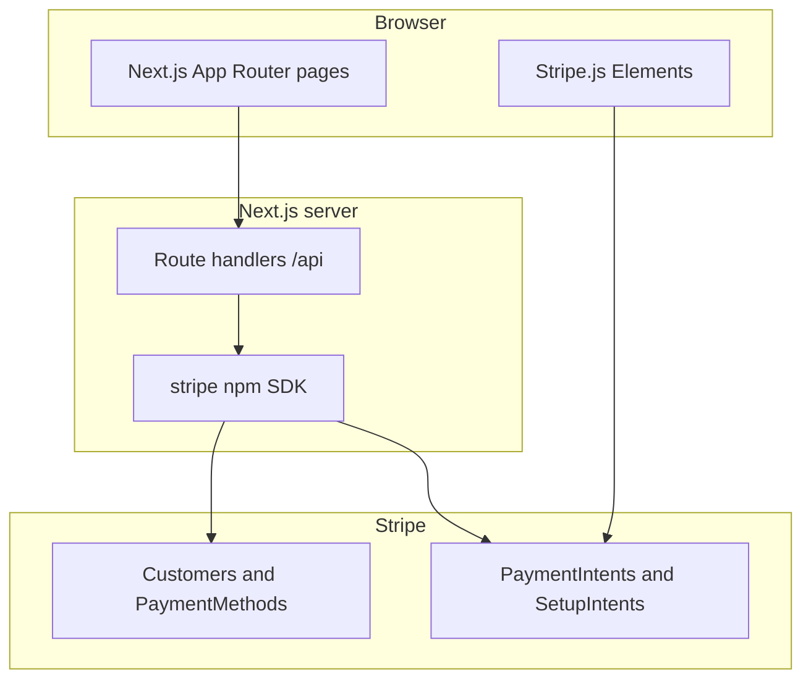

# Lazy Bread PDX — Web storefront

Customer-facing Next.js app for **Lazy Bread PDX**, an organic sourdough bakery in Portland, Oregon. Visitors browse products, place one-time delivery or pickup orders, and pay with Stripe as guests — no account required.

This README explains **what the interface does** and how it connects to **Stripe** and other services.

---

## Architecture (high level)



- **Client:** React 19, App Router, Tailwind. Global state for remote config lives in React context (`ConfigProvider`).
- **Server:** Next.js Route Handlers under `src/app/api/**` call the Stripe SDK. They never expose `STRIPE_SECRET_KEY` to the browser.
- **Data:** There is no account/user database — orders are processed as Stripe Setup Intents keyed by the guest's email, with order details carried in Stripe metadata.

---

## Main user flows

### Ordering

1. **Order** (`/order`) — Customer selects bread, delivery/pickup date, and address/contact. Validation uses baked-in config from `src/config/app-config.ts`, optionally overridden by runtime config (see below).
2. **Persist draft** — The composed payload is saved to **`sessionStorage`** as `orderData` before navigating to payment.
3. **Payment** (`/order/payment`) — Loads `orderData`, creates a Stripe **Setup Intent** for a guest customer (`/api/stripe/setup-intent/create`) so the card is only charged once the order is fulfilled.
4. **Success** — Completion clears `orderData` and stores a short-lived `paymentSuccess` payload for the home experience.

There is no sign-in — every order is a guest checkout.

### Stripe

| Concept | Role in this app |
|--------|-------------------|
| **Customer** | One per guest order, found/created by email via `createOrFindCustomer`. |
| **Setup Intent** | Collects and saves a card without charging immediately, so the bakery can charge once the order is fulfilled. Created via `/api/stripe/setup-intent/create`. |
| **Manual capture** | Payment intents (legacy routes, currently unused by the UI) use `capture_method: 'manual'` so the bakery can capture when the order is ready. |

Server-side Stripe logic is centralized in `src/lib/stripeService.ts` (`"use server"`); API routes delegate to these functions.

---

## Runtime configuration (optional)

If `NEXT_PUBLIC_CONFIG_S3_URL` is set, `ConfigProvider` fetches a JSON document (e.g. from S3) via `configService.ts` and merges it into runtime settings (bread catalog, holiday mode, delivery zones, validation rules). If the fetch fails, the app falls back to `src/config/app-config.ts`.

---

## Other dependencies (what they’re for)

| Package | Purpose |
|---------|---------|
| `next`, `react`, `react-dom` | App framework and UI |
| `stripe` | Server Stripe API |
| `@stripe/stripe-js`, `@stripe/react-stripe-js` | Card UI and confirmation in the browser |
| `react-google-recaptcha` | Bot mitigation on sensitive forms |

Optional observability: **Datadog RUM** scripts in `layout.tsx` when `NEXT_PUBLIC_DD_RUM_*` env vars are set.

---

## Environment variables

- **Stripe:** `NEXT_PUBLIC_STRIPE_PUBLISHABLE_KEY`, `STRIPE_SECRET_KEY`.
- **App URL:** `HOSTNAME` — used in Stripe return URLs.
- **reCAPTCHA, Datadog, config URL:** optional; see any `.env.example` you maintain locally.

---

## Local development

```bash
npm install
npm run dev
```

Open [http://localhost:3000](http://localhost:3000).

```bash
npm run build   # production build
npm run start   # run production server
npm run lint    # ESLint (Next.js)
```

---

## Deploy

Typical hosting: **Vercel** (or any Node host) with the same environment variables as production.

---

## Learn more

- [Next.js Documentation](https://nextjs.org/docs)
- [Stripe](https://stripe.com/docs)
