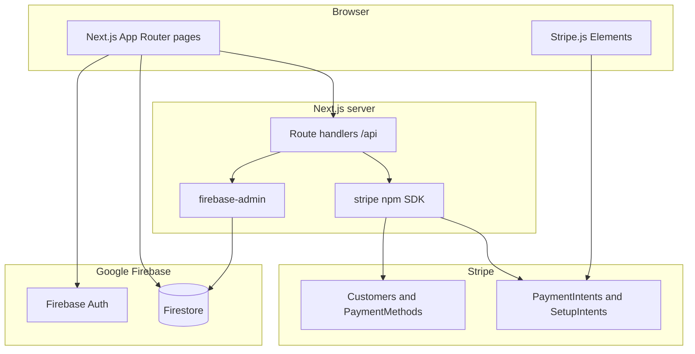

# Lazy Bread PDX — Web storefront

Customer-facing Next.js app for **Lazy Bread PDX**, an organic sourdough bakery in Portland, Oregon. Visitors browse products, place one-time or recurring delivery orders, pay with Stripe, and (when signed in) manage saved addresses, payment methods, orders, and subscriptions from a dashboard.

This README explains **what the interface does** and how it connects to **Firebase**, **Stripe**, and other services.

---

## Architecture (high level)



- **Client:** React 19, App Router, Tailwind. Global state for auth and remote config lives in React context (`AuthProvider`, `ConfigProvider`).
- **Server:** Next.js Route Handlers under `src/app/api/**` call the Stripe SDK and Firebase Admin. They never expose `STRIPE_SECRET_KEY` or service account JSON to the browser.
- **Data:** Firestore holds app data (users, orders, subscriptions). Firebase Auth handles email/password identity; the Firestore `users` collection stores profile fields including `stripeCustomerId`.

---

## Main user flows

### Ordering

1. **Order** (`/order`) — Customer selects bread, delivery date, address/contact, and optional subscription frequency. Validation uses baked-in config from `src/config/app-config.ts`, optionally overridden by runtime config (see below).
2. **Persist draft** — The composed payload is saved to **`sessionStorage`** as `orderData` before navigating to payment.
3. **Payment** (`/order/payment`) — Loads `orderData`, creates a Stripe **Setup Intent** (save card) or uses saved methods depending on flow. Logged-in users send a Firebase **ID token** so the API can resolve or create a Stripe customer tied to their Firestore profile.
4. **Success** — Completion clears `orderData` and stores a short-lived `paymentSuccess` payload for the home experience if needed.

Guests can checkout without an account; signed-in users get profile prefill and can save address updates to Firestore.

### Authentication

- **Firebase Auth (client):** Email/password sign-in, sign-up, password reset via `src/lib/firebase.ts` and `AuthContext`.
- **Sign-up:** Creates a **Stripe customer** (`createOrFindCustomer` in `stripeService`) and a **Firestore user document** with `uid`, `email`, `displayName`, and `stripeCustomerId`.
- **Session:** `onAuthStateChanged` loads the matching Firestore profile (`users` where `uid` matches). `userProfile` is exposed app-wide through `useAuth()`.
- **reCAPTCHA:** Sign-up and related API routes can verify tokens server-side (`GOOGLE_CAPTCHA_SECRET_KEY`, `NEXT_PUBLIC_RECAPTCHA_SITE_KEY`).
- **Legacy `/api/auth/signin`:** Exists for server-side sign-in experiments; primary UX uses client-side Firebase Auth.

### Stripe

| Concept | Role in this app |
|--------|-------------------|
| **Customer** | One per payer; ID stored on `UserProfile.stripeCustomerId` when applicable. |
| **Setup Intent** | Collect and save a card for later (subscriptions and “save card” flows). Created via `/api/stripe/setup-intent/create`. |
| **Payment Intent** | Charge order totals; metadata carries order snapshot for fulfillment. Created/updated via `/api/stripe/payment-intent/*`. |
| **Manual capture** | Payment intents use `capture_method: 'manual'` so the bakery can capture when the order is ready. |

Server-side Stripe logic is centralized in `src/lib/stripeService.ts` (“use server”); API routes delegate to these functions.

### Dashboard (`/dashboard`)

Signed-in customers see orders (by email), subscriptions, and tools to add or manage payment methods. Data comes from Firestore (`orders`, `subscriptions`, `users`) and Stripe (payment methods, customer), using the client Firebase SDK where rules allow and REST `/api/stripe/*` helpers where secrets stay on the server.

---

## Firebase: client vs Admin

| | Client SDK (`firebase`) | Admin SDK (`firebase-admin`) |
|---|-------------------------|------------------------------|
| **Where** | `src/lib/firebase.ts`, `firebaseService.ts`, browser | `src/lib/firebaseAdmin.ts`, API routes only |
| **Auth** | Sign-in, session | Verify ID tokens, optional `getUser(uid)` |
| **Firestore** | Logged-in user reads/writes per security rules | Trusted reads/writes by `uid` (e.g. attach `stripeCustomerId`) |

### Firestore collections (conceptual)

- **`users`** — Profile: `uid`, `email`, `displayName`, delivery fields, `stripeCustomerId`, timestamps. Documents are created at sign-up or via Admin when backfilling a customer id.
- **`orders`** — Order history; queried by `email` (and related fields) for the dashboard.
- **`subscriptions`** — Recurring delivery subscriptions linked to `userId`.

Exact fields match `src/lib/types.ts` and usage in `firebaseService.ts`.

---

## Runtime configuration (optional)

If `NEXT_PUBLIC_CONFIG_S3_URL` is set, `ConfigProvider` fetches a JSON document (e.g. from S3) via `configService.ts` and merges it into runtime settings (bread catalog, holiday mode, delivery zones, validation rules). If the fetch fails, the app falls back to `src/config/app-config.ts`.

---

## Other dependencies (what they’re for)

| Package | Purpose |
|---------|---------|
| `next`, `react`, `react-dom` | App framework and UI |
| `firebase` | Auth + Firestore in the browser |
| `firebase-admin` | Server-only Firestore/Auth for API routes |
| `stripe` | Server Stripe API |
| `@stripe/stripe-js`, `@stripe/react-stripe-js` | Card UI and confirmation in the browser |
| `react-google-recaptcha` | Bot mitigation on sensitive forms |
| `react-firebase-hooks` | Optional Firebase/React helpers where used |

Optional observability: **Datadog RUM** scripts in `layout.tsx` when `NEXT_PUBLIC_DD_RUM_*` env vars are set.

---

## Environment variables

Copy `.env.example` to `.env.local` and fill in values. In short:

- **Firebase (public):** `NEXT_PUBLIC_FIREBASE_*` — from Firebase Console → Project settings → Your apps.
- **Firebase Admin (secret):** `FIREBASE_SERVICE_ACCOUNT_JSON` — service account JSON string for API routes, or use Application Default Credentials locally.
- **Stripe:** `NEXT_PUBLIC_STRIPE_PUBLISHABLE_KEY`, `STRIPE_SECRET_KEY`.
- **App URL:** `HOSTNAME` — used in Stripe return URLs.
- **reCAPTCHA, Datadog, config URL:** optional; see `.env.example`.

---

## Local development

```bash
npm install
npm run dev
```

Open [http://localhost:3000](http://localhost:3000).

```bash
npm run build   # production build
npm run start   # run production server
npm run lint    # ESLint (Next.js)
```

---

## Deploy

Typical hosting: **Vercel** (or any Node host) with the same environment variables as production. Ensure Stripe webhooks (if you add them later) point at your deployed API domain and that Firestore security rules match how the client and Admin SDK access data.

---

## Learn more

- [Next.js Documentation](https://nextjs.org/docs)
- [Firebase](https://firebase.google.com/docs)
- [Stripe](https://stripe.com/docs)
